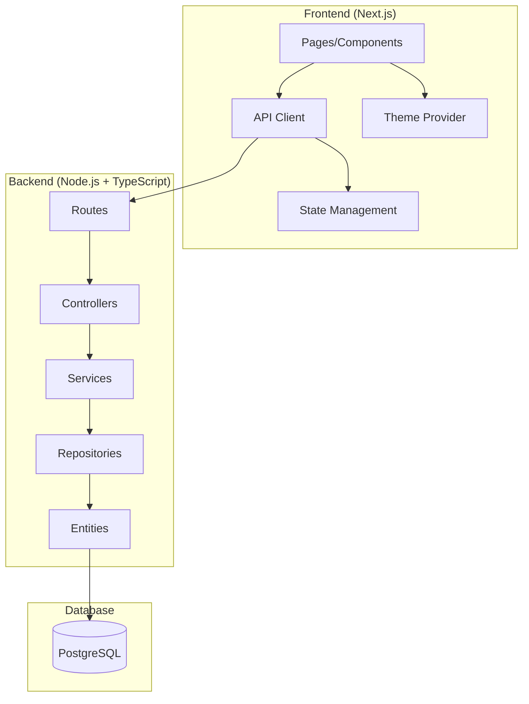

# Design Document

## Overview

The Mini LinkedIn-like Community Platform will be built as a full-stack application with a clear separation between backend and frontend. The backend will serve as a REST API built with Node.js, TypeScript, and Mikro-ORM, while the frontend will be a Next.js application with server-side rendering capabilities, Tailwind CSS for styling, and shadcn/ui for components.

The architecture follows a clean separation of concerns with the backend handling data persistence, business logic, and API endpoints, while the frontend manages user interface, state management, and user interactions.

## Architecture

### High-Level Architecture



### Technology Stack

**Backend:**
- Node.js with TypeScript for type safety
- tsx for TypeScript execution
- Mikro-ORM for database operations and migrations
- PostgreSQL as the primary database
- Express.js for HTTP server and routing
- bcrypt for password hashing
- jsonwebtoken for JWT authentication
- cors for cross-origin requests
- helmet for security headers

**Frontend:**
- Next.js 14+ with App Router
- TypeScript for type safety
- Tailwind CSS for utility-first styling
- shadcn/ui for pre-built components
- next-themes for theme management
- React Hook Form for form handling
- Zod for client-side validation
- Axios or fetch for API communication

## Components and Interfaces

### Backend Components

#### 1. Entities (Database Models)

**User Entity:**
```typescript
interface User {
  id: number;
  email: string;
  name: string;
  password: string; // hashed
  bio?: string;
  createdAt: Date;
  updatedAt: Date;
  posts: Post[];
}
```

**Post Entity:**
```typescript
interface Post {
  id: number;
  content: string;
  authorId: number;
  author: User;
  createdAt: Date;
  updatedAt: Date;
}
```

#### 2. API Endpoints

**Authentication Routes:**
- `POST /api/auth/register` - User registration
- `POST /api/auth/login` - User login
- `POST /api/auth/logout` - User logout
- `GET /api/auth/me` - Get current user

**User Routes:**
- `GET /api/users/:id` - Get user profile
- `PUT /api/users/:id` - Update user profile
- `GET /api/users/:id/posts` - Get user's posts

**Post Routes:**
- `GET /api/posts` - Get all posts (feed)
- `POST /api/posts` - Create new post
- `GET /api/posts/:id` - Get specific post

#### 3. Service Layer

**AuthService:**
- User registration with password hashing
- User authentication and JWT token generation
- Password validation and security checks

**UserService:**
- User profile management
- User data retrieval and updates
- Bio validation and sanitization

**PostService:**
- Post creation and validation
- Feed generation with pagination
- Post retrieval by user or ID

#### 4. Middleware

**Authentication Middleware:**
- JWT token validation
- User session management
- Protected route handling

**Validation Middleware:**
- Request body validation
- Input sanitization
- Error formatting

### Frontend Components

#### 1. Pages

**Authentication Pages:**
- `/login` - Login form with validation
- `/register` - Registration form with validation

**Main Pages:**
- `/` - Home feed with all posts
- `/profile/[id]` - User profile page
- `/profile/edit` - Edit own profile

#### 2. Components

**Layout Components:**
- `Header` - Navigation with theme toggle and user menu
- `Layout` - Main layout wrapper with theme provider
- `ThemeToggle` - Light/dark theme switcher

**Authentication Components:**
- `LoginForm` - Login form with validation
- `RegisterForm` - Registration form with validation
- `AuthGuard` - Protected route wrapper

**Post Components:**
- `PostCard` - Individual post display
- `PostForm` - Create new post form
- `PostFeed` - List of posts with infinite scroll

**Profile Components:**
- `ProfileHeader` - User info display
- `ProfilePosts` - User's posts list
- `EditProfile` - Profile editing form

**UI Components:**
- `Button` - Customizable button component
- `Input` - Form input with validation
- `Card` - Content container
- `Avatar` - User profile picture placeholder
- `LoadingSpinner` - Loading state indicator
- `ErrorMessage` - Error display component

## Data Models

### Database Schema

**Users Table:**
```sql
CREATE TABLE users (
  id SERIAL PRIMARY KEY,
  email VARCHAR(255) UNIQUE NOT NULL,
  name VARCHAR(255) NOT NULL,
  password VARCHAR(255) NOT NULL,
  bio TEXT,
  created_at TIMESTAMP DEFAULT CURRENT_TIMESTAMP,
  updated_at TIMESTAMP DEFAULT CURRENT_TIMESTAMP
);
```

**Posts Table:**
```sql
CREATE TABLE posts (
  id SERIAL PRIMARY KEY,
  content TEXT NOT NULL,
  author_id INTEGER REFERENCES users(id) ON DELETE CASCADE,
  created_at TIMESTAMP DEFAULT CURRENT_TIMESTAMP,
  updated_at TIMESTAMP DEFAULT CURRENT_TIMESTAMP
);
```

**Indexes:**
- `users.email` - Unique index for fast login lookups
- `posts.author_id` - Index for user posts queries
- `posts.created_at` - Index for chronological ordering

### API Response Models

**User Response:**
```typescript
interface UserResponse {
  id: number;
  email: string;
  name: string;
  bio?: string;
  createdAt: string;
}
```

**Post Response:**
```typescript
interface PostResponse {
  id: number;
  content: string;
  author: {
    id: number;
    name: string;
  };
  createdAt: string;
}
```

**Authentication Response:**
```typescript
interface AuthResponse {
  user: UserResponse;
  token: string;
}
```

## Error Handling

### Backend Error Handling

**Error Types:**
- `ValidationError` - Input validation failures
- `AuthenticationError` - Authentication failures
- `AuthorizationError` - Permission denied
- `NotFoundError` - Resource not found
- `DatabaseError` - Database operation failures

**Error Response Format:**
```typescript
interface ErrorResponse {
  error: {
    message: string;
    code: string;
    details?: any;
  };
}
```

**Global Error Handler:**
- Catch all unhandled errors
- Log errors for debugging
- Return appropriate HTTP status codes
- Sanitize error messages for security

### Frontend Error Handling

**Error Boundaries:**
- React error boundaries for component errors
- Fallback UI for broken components
- Error reporting and logging

**API Error Handling:**
- Axios interceptors for global error handling
- Toast notifications for user feedback
- Retry mechanisms for network failures
- Loading states during API calls

## Testing Strategy

### Backend Testing

**Unit Tests:**
- Service layer business logic
- Utility functions and helpers
- Database entity methods
- Authentication middleware

**Integration Tests:**
- API endpoint testing
- Database operations
- Authentication flows
- Error handling scenarios

**Test Tools:**
- Jest for test framework
- Supertest for API testing
- Test database for isolation

### Frontend Testing

**Component Tests:**
- React component rendering
- User interaction testing
- Form validation testing
- Theme switching functionality

**Integration Tests:**
- API integration testing
- Authentication flow testing
- Navigation and routing
- State management testing

**Test Tools:**
- Jest and React Testing Library
- MSW for API mocking
- Cypress for E2E testing (optional)

## Security Considerations

**Authentication Security:**
- Password hashing with bcrypt (minimum 12 rounds)
- JWT token expiration and refresh
- Secure HTTP-only cookies for sessions
- CORS configuration for API access

**Input Validation:**
- Server-side validation for all inputs
- SQL injection prevention through ORM
- XSS prevention through input sanitization
- Rate limiting for API endpoints

**Data Protection:**
- Environment variables for secrets
- Database connection encryption
- HTTPS enforcement in production
- Secure headers with Helmet.js

## Theme System Design

### Theme Architecture

**Theme Provider Structure:**
- Context-based theme management
- CSS custom properties for theme variables
- Tailwind CSS dark mode classes
- Persistent theme storage in localStorage

**Theme Configuration:**
```typescript
interface ThemeConfig {
  colors: {
    primary: string;
    secondary: string;
    background: string;
    foreground: string;
    muted: string;
    accent: string;
  };
  fonts: {
    sans: string[];
    mono: string[];
  };
}
```

**Customizable Themes:**
- Light theme (default)
- Dark theme
- System preference detection
- Future support for custom color schemes

## Deployment Architecture

### Development Environment

**Backend Setup:**
- Local PostgreSQL database
- Environment variables for configuration
- Hot reloading with tsx
- Database migrations and seeding

**Frontend Setup:**
- Next.js development server
- Tailwind CSS compilation
- Component development with Storybook (optional)
- API proxy configuration for backend

### Production Deployment

**Backend Deployment:**
- Docker containerization
- Environment-based configuration
- Database migration automation
- Health check endpoints

**Frontend Deployment:**
- Static site generation where possible
- CDN deployment for assets
- Environment variable configuration
- Build optimization and bundling

**Infrastructure:**
- Separate backend and frontend deployments
- Database hosting (PostgreSQL)
- Environment separation (dev/staging/prod)
- Monitoring and logging setup